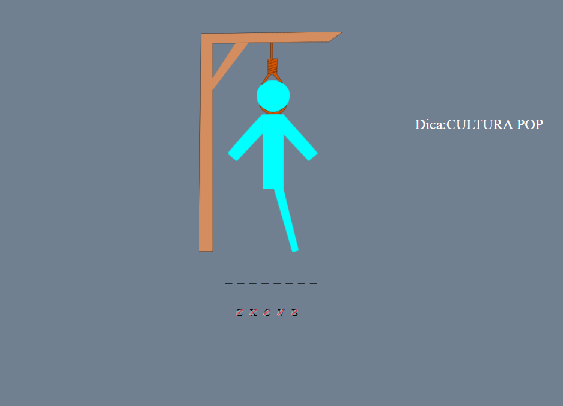
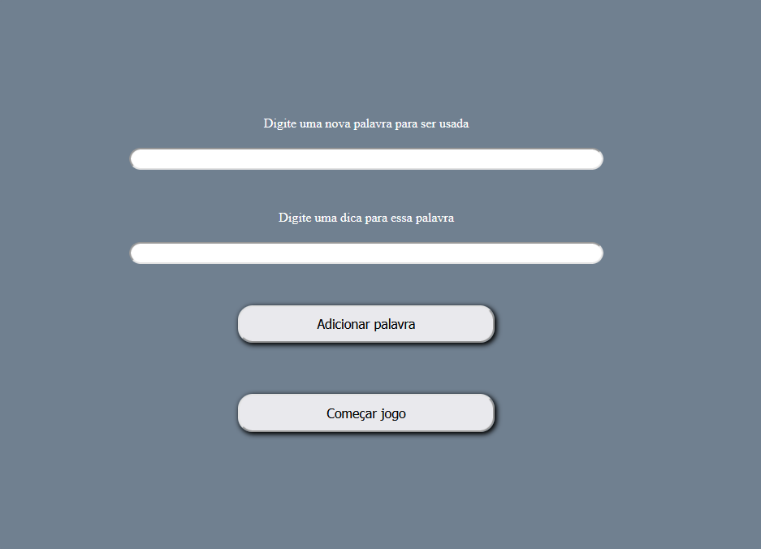
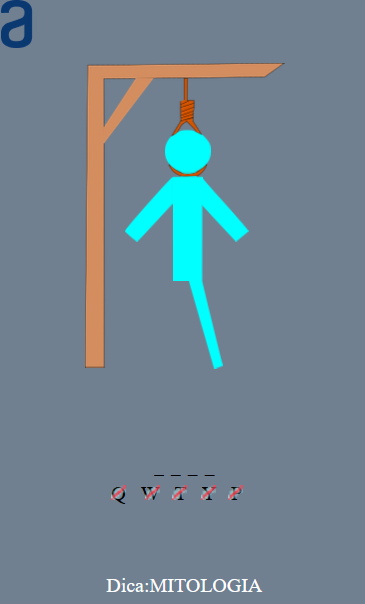

# AluraONEsprint-2-Hangman

### Para a sprint 2 de Lógica de Programação da Alura
  
<h1>

 :skull_and_crossbones: Jogo da Forca :skull_and_crossbones: 

</h1>

Uma adaptação de clássico bem conhecido, cada palavra tem **SETE** tentativas para acerta-la. Mais não se preocupe pois cada palavra tem uma **DICA**.

<strong> Caso você ache que tem poucas palavras ou gostaria de fazer alguma adição ao seu jogo você pode adicionar palavras a lista que pode ser usada no jogo.</strong>

 

Aqui estão algumas imagens de amostra

 

Gameplay :video_game:

 

Adicionar novas palavras :file_cabinet:

 

Gameplay no mobile :iphone:

